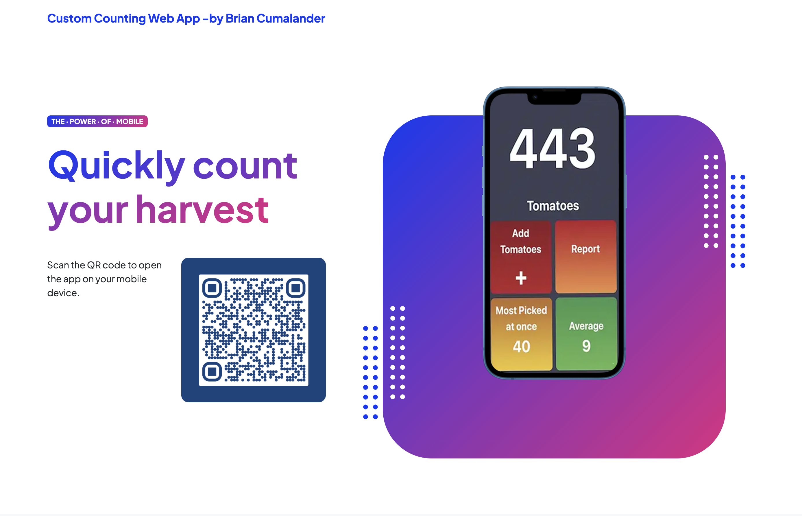

# Tomatoes

My girlfriend and I had a garden of cherry tomatoes that was growing by leaps and bounds. 
I made this record keeping web app to keep track of how many tomatoes we picked that summer. 
In total, we picked 443 tomatoes in the course of 4 months!

* Uses PHP, mySQL, Materialize, and custom CSS.

## Screenshots

